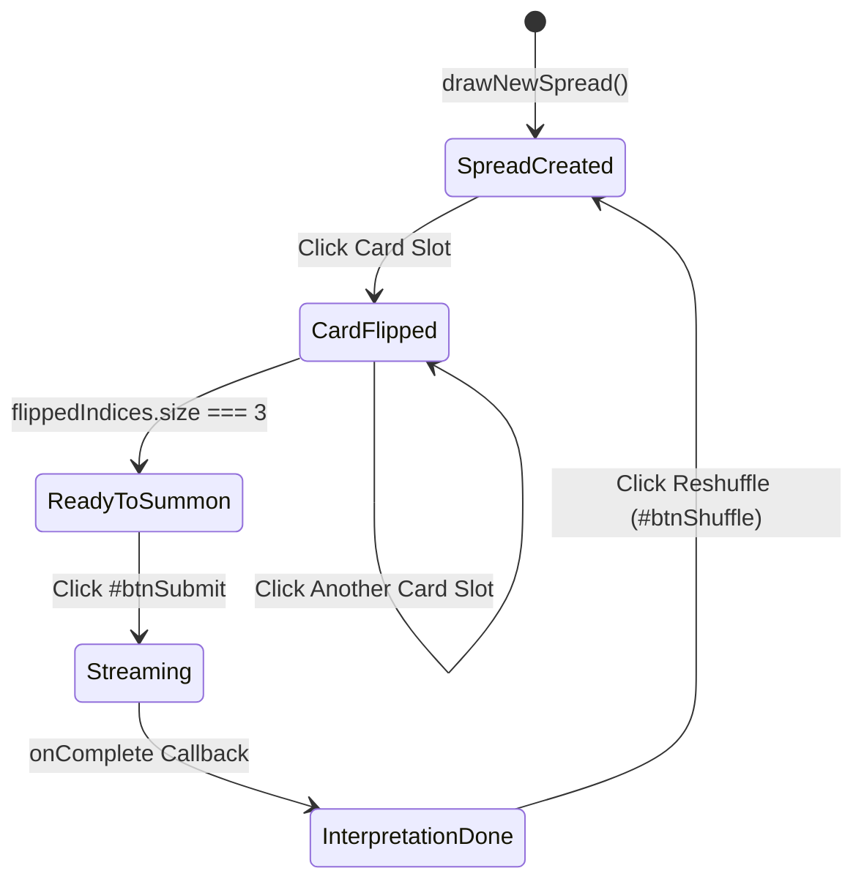

# Dark Academia Tarot 项目结构与架构说明

本文档记录 **Dark Academia Tarot (`ARCANA • TENEBRIS`)** 的主要目录、运行时架构、核心组件划分与交互机制，方便后续维护、调试与新特性扩展。更多设计决策与取舍说明，请参见 [docs/decisions](./decisions/) 下的 ADR 文档。

最后更新：2026-07-18

---

## 1. 架构总览

**Dark Academia Tarot** 是一款基于 **Tauri v2 + Rust + TypeScript + Vite + Vanilla CSS** 的轻量级透明置顶桌面塔罗牌占卜微件程序。
- **Rust / Tauri 主进程** 负责应用窗口初始化（透明无边框、去掉系统阴影、常驻全局置顶）、本地环境适配以及敏感参数（如内置 Gemini API 免费密钥的 XOR 混淆解密）的安全 IPC 服务。
- **Web 渲染进程** 负责卡牌抽牌与三维翻牌状态机、精美暗黑哥特美学 UI 渲染、提问输入框交互、双引擎切换设置管理以及和 Google Gemini AI 流式接口的连接与内容展现。

```mermaid
graph TB
    subgraph Main["Tauri Main Process (Rust)"]
        MainRs["src-tauri/src/main.rs<br/>Tauri Entry"] --> LibRs["src-tauri/src/lib.rs<br/>Window Setup & App Builder"]
        LibRs --> WindowConfig["set_shadow(false) & Transparent Setup"]
        LibRs --> XOR["DEFAULT_GEMINI_KEY_XOR & XOR_SECRET"]
        LibRs --> IPC["#[tauri::command]<br/>get_fallback_api_key"]
    end

    subgraph Renderer["Frontend Renderer Process (Vite + TS)"]
        IndexHtml["index.html + src/styles.css"] --> MainTs["src/main.ts"]
        MainTs --> TarotWidget["TarotWidget.ts<br/>Widget Controller & State Machine"]
        
        subgraph Components["UI Components Layer"]
            TarotWidget --> CardsGrid["Floating 3-Cards Grid<br/>Flipping State & Animations"]
            TarotWidget --> InputCapsule["Question Input Capsule<br/>#questionInput & Submit Button"]
            TarotWidget --> HeaderCapsule["Header Drag Handle<br/>Reshuffle / Settings / Exit"]
            TarotWidget --> SettingsModal["SettingsModal.ts<br/>Engine Mode Switcher & LocalStorage"]
        end

        subgraph Services["Services & Data Layer"]
            TarotWidget --> GeminiService["GeminiService.ts<br/>Streaming Interpretation Engine"]
            TarotWidget --> TarotDeck["tarotDeck.ts<br/>Single Source of Truth (MAJOR_ARCANA)"]
            GeminiService --> |1. Check Mode & Local Key| SettingsModal
            GeminiService --> |2. Invoke IPC (Builtin Mode)| IPC
            GeminiService --> |3. Stream API Request| GoogleGemini["Google Generative AI API (@google/generative-ai)"]
        end
    end
```

---

## 2. 目录结构与核心映射

```text
Tarot/
├── AGENTS.md                          # Codex / Agent 项目操作与规范指南
├── CHANGELOG.md                       # 版本变更记录 (Keep a Changelog)
├── package.json                       # npm 依赖与构建配置 (vite, tsc, tauri)
├── tsconfig.json                      # TypeScript 编译选项
├── tauri.conf.json                    # 软链至 src-tauri/tauri.conf.json (构建目标/窗口设置)
├── index.html                         # 应用骨架 HTML 入口
├── public/
│   └── assets/                        # 静态资源 (卡牌背图及正位卡面图)
├── scripts/
│   └── generate_assets.mjs            # 自动化卡牌图形生成/预处理脚本
├── docs/
│   ├── structure.md                   # 本架构与组件映射文档
│   └── decisions/                     # 架构决策记录 (ADR)
│       ├── ADR-001-tauri-frameless-transparent-window.md
│       ├── ADR-002-gemini-ai-streaming-and-xor-fallback-key.md
│       ├── ADR-003-tarot-deck-single-source-of-truth.md
│       └── ADR-004-tauri-v2-system-tray-management.md
├── src/
│   ├── main.ts                        # 前端主入口，挂载 #app -> TarotWidget
│   ├── styles.css                     # Dark Academia 核心样式、玻璃拟态及翻牌 3D 动画
│   ├── components/
│   │   ├── TarotWidget.ts             # 微件主视图控制器、卡面网格与交互逻辑
│   │   └── SettingsModal.ts           # 占星引擎切换(内置版/定制版)模态弹窗
│   ├── data/
│   │   ├── tarotDeck.ts               # 大阿卡纳数据模型、寓意与随机牌阵抽牌算法
│   │   └── tarotDeck.test.ts          # 数据模型与抽牌算法测试
│   └── services/
│       ├── GeminiService.ts           # Gemini 流式占卜生成引擎、思考块过滤与多模型降级
│       └── GeminiService.test.ts      # 占卜引擎服务与回退拦截降级测试
└── src-tauri/
    ├── Cargo.toml                     # Rust 依赖声明
    ├── tauri.conf.json                # Tauri 配置文件 (520x720, 置顶, 透明, 无边框)
    └── src/
        ├── lib.rs                     # 窗口阴影清除、XOR 密钥常量及解密 IPC 接口
        └── main.rs                    # Native 启动入口
```

---

## 3. 核心机制解析

### 3.1 窗口与拖拽事件隔离机制 (`data-tauri-drag-region`)
Tauri 无边框透明窗口在 macOS 和 Windows 体系下具有不同的鼠标捕获特性。为了兼顾“窗口全局可拖动”与“内部组件精准交互”，我们构建了严格的隔离层划分：
- **拖拽触发层 (`data-tauri-drag-region`)**：
  - `<div class="widget-root" data-tauri-drag-region>`：底层根容器。
  - `<div class="floating-header-capsule" data-tauri-drag-region>`：顶层标题栏底框。
  - `<div class="floating-cards-grid" data-tauri-drag-region>`：卡牌网格空白区域。
  - 作用：按住这些空隙即可任意拖曳调整微件在桌面的坐标。
- **事件隔离层 (`data-tauri-drag-region="false"`)**：
  - `<div class="header-actions" data-tauri-drag-region="false">`：包含洗牌、设置、退出按钮，防止点击触发窗体拖放。
  - `<div class="floating-input-capsule" data-tauri-drag-region="false">`：提问输入框与召唤按钮，保证光标聚集、文本选中与高频点击。
  - `#interpretationContainer` 与 `.modal-backdrop`：防止长篇解答文本滚动或设置页操作被原生窗体移动吞噬。

### 3.2 卡牌翻转与召唤状态机 (`TarotWidget.ts`)

- **核心约束**：只有当用户手动或逐一揭开全部 3 张牌（`flippedIndices.size === this.cards.length`）时，输入框右侧的召唤按钮 `#btnSubmit` 才会被解除 `disabled` 状态。
- **安全锁 (`isGenerating`)**：在 AI 流式输出期间 (`isGenerating === true`)，会锁死重新洗牌 (`drawNewSpread`) 和提交点击，杜绝竞态与界面撕裂。

### 3.3 AI 流式管线与 XOR 解密密钥交互 (`GeminiService.ts`)
1. **模式检查**：读取 `SettingsModal.getEngineMode()`。若为 `custom` 且 `localStorage` 中存在有效专属 API Key，则直接优先使用。
2. **IPC 解密**：若为 `builtin` (内置免费版) 或缺少用户 Key，调用 `invoke('get_fallback_api_key')`。后端 `lib.rs` 针对编译入二进制文件的常量 `DEFAULT_GEMINI_KEY_XOR` 进行单字节运算 `(b ^ 0x5A) as char`，将解密后的 `AIzaSy...` 字符串返回给前端。
3. **多模型候选降级**：依次尝试 `['gemini-2.0-flash', 'gemma-4-31b-it', 'gemini-flash-latest']`。
4. **思考链纯净过滤**：在 `generateContentStream` 处理 Chunk 块时，判断 `part.thought === true` 则立即跳过，仅推送真正属于占星指导正文的文本到 `onChunk` 渲染，保护古典文风连续性。

---

## 4. 关键脚本与维护命令

| 命令 | 用途描述 |
| :--- | :--- |
| `npm run dev` | 启动 Vite 前端热更新开发服务器 (http://localhost:5173) |
| `npm run build` | 生产环境前端构建：执行 `tsc` 严苛类型检查 + `vite build` |
| `npm run test` | 执行 Vite 前端单元测试 (Vitest)，验证核心业务逻辑 |
| `npm run tauri dev` | 启动完整的 Tauri 原生应用开发环境 (前后端联调与热更) |
| `npm run tauri build` | 编译构建适用于当前操作系统的桌面原生可执行程序/安装包 |
| `cargo test` | 在 `src-tauri` 目录下执行，运行 Rust 后端内置单元测试 |
